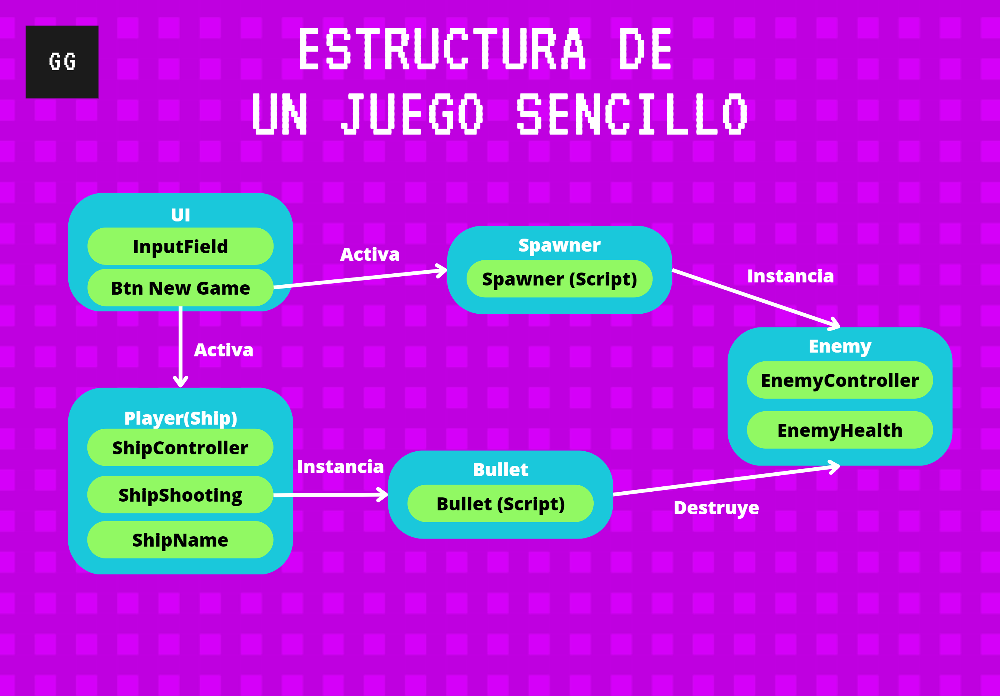

# Clase Scripting en Unity

En esta clase trabajaremos una introducción al scripting en Unity, y además veremos las formas de entrada de datos del usuario asi como las formas de comunicación entre distintos GameObjects.

Pueden encontrar la presentación de la clase en el siguiente enlace:

[Presentación de la Clase](https://www.canva.com/design/DAFct2UNMmE/cFaUvy4SEFzYbfTXTkdY5Q/view?utm_content=DAFct2UNMmE&utm_campaign=designshare&utm_medium=link&utm_source=publishsharelink)

La idea de la clase no consiste en enseñar C# como tal, sino que podamos usar los insumos de este 
lenguaje para desarrollar juegos. 
Por lo tanto, a continuación están dos links a cheat sheets el primero sobre variables, funciones, 
listas y demás de C#. El segundo contiene los elementos básicos para el scripting en Unity.

[Cheat Sheet C#](https://cheatography.com/veyleria/cheat-sheets/general-c/)

[Cheat Sheet Unity](https://www.canva.com/design/DAFct2UNMmE/cFaUvy4SEFzYbfTXTkdY5Q/view?utm_content=DAFct2UNMmE&utm_campaign=designshare&utm_medium=link&utm_source=publishsharelink)

Adicionalmente, la documentación de Unity es bastante buena y haremos referencia a ella siempre que podamos.

[Documentación Unity](https://docs.unity3d.com/Manual/index.html)

[Introducción al Scripting](https://docs.unity3d.com/Manual/CreatingAndUsingScripts.html)

## Estructura de Juego

Para analizar el scripting en unity hemos construido un pequeño juego de naves, esto es importante 
porque de esta manera se puede visualizar como funcionan en un ambiente real los componentes que estamos
estudiando.



### La Nave

Esta cuenta con tres scripts, ShipController para el movimiento de la nave, 
ShipShooting que se encarga de manejar los disparos y ShipName que permite modificar
el nombre que tiene la nave en la parte inferior.

#### Script ShipController

De este script lo que nos interesa es la función ShipMovement que se llama en el Update, esta lo 
primero que hace es recoger la posición actual de la nave con el componente Transform. 

```
 Vector3 nextShipPos = transform.position;
```

**Recuerden que todos los GameObjects en Unity poseén este componente para saber su lugar en el mundo.**
[Documentación Transform](https://docs.unity3d.com/Manual/class-Transform.html)
[Documentación Input](https://docs.unity3d.com/Manual/class-InputManager.html)

Toma entonces la posición en X y recoge el Input del Axis "Horizontal" (que fluctua entre -1 y 1), lo
multiplica por la velocidad y por el tiempo entre frames. **Recuerden que siempre es importante
multiplicar por Time.deltatime para mantener las mecánicas de juego independientes del hardware
sobre el que esten funcionando.

```
float nextPosX = nextShipPos.x + Input.GetAxis("Horizontal") * speed * Time.deltaTime;
```

Lo limita y entonces procede a asignarlo nuevamente a la posición del Transform, lo que moverá
el Gameobject donde esta asignado este script.

```
nextShipPos.x = Mathf.Clamp(nextPosX, -91f, 91f); 
transform.position = nextShipPos;
```

#### Script ShipShooting

Este script se encarga de crear las balas según se presione una tecla asignada, en este caso V,
o si se presiona el Axis Fire1, que corresponde al click izquierdo del ratón. Analicemos entonces 
las partes que más nos interesan.

Aqui tenemos un campo privado pero que utiliza SerializeField, lo que permite que se muestre y
que podamos asignarle un valor directamente desde el editor. En este caso particular solo aceptará
un GameObject que posea un script Bullet.

```
[SerializeField] private Bullet bullet;   
```

Aqui podemos observar dos formas de recoger datos del usuario, ambas usando la clase Input. La
primera recoge solo una vez cuando se presiona la tecla V. La segunda recoge en cambio si se encuentra
presionado el Axis Fire1 que corresponde al botón izquierdo del Mouse.
```
if (Input.GetKeyDown(KeyCode.V) || Input.GetAxis("Fire1") != 0)
```
 
La función Instantiate en Unity nos sirve para crear un nuevo GameObject a partir de un prefab,
a esta se la pasa como parámetros, un script (ligado a un GameObject) o un GameObject directamente,
una posición (o puede ser un Transform) y una rotación. A su vez, esta devuelve el objeto instanciado,
que lo podemos recoger en una nueva variable.

[Documentación Instantiate](https://docs.unity3d.com/ScriptReference/Object.Instantiate.html)

```
Bullet bulletInstance = Instantiate(bullet, bulletStartPosition.position, Quaternion.identity);            
```

Todo este script hace entonces que se cree una nueva bala si el intervalo de tiempo transcurrido
es suficiente.